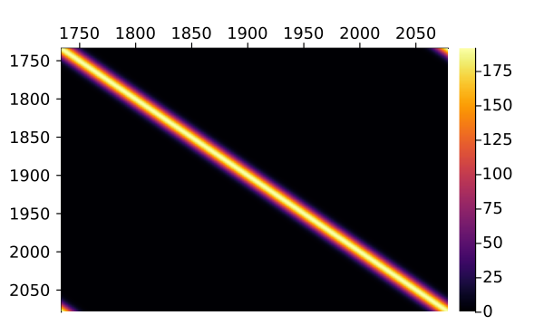
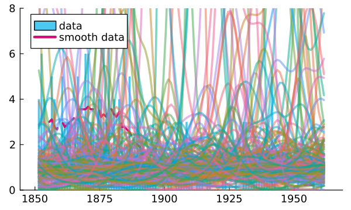
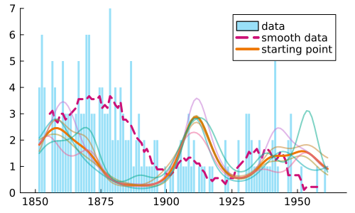
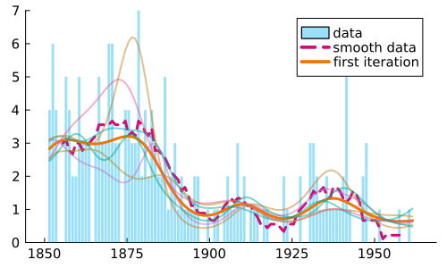
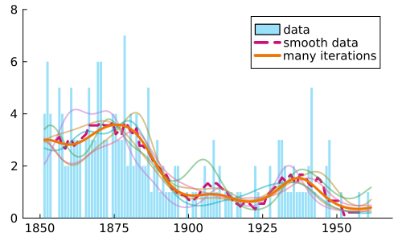
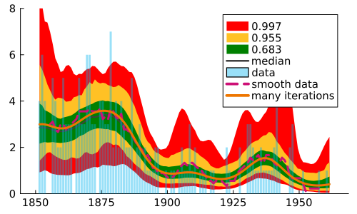
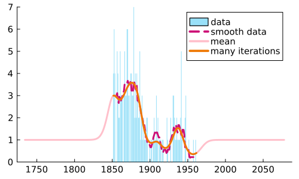
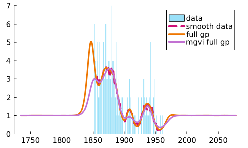

```@meta
EditURL = "advanced_tutorial_lit.jl"
```

# Advanced Tutorial
Notebook [download](advanced_tutorial.ipynb) [source](advanced_tutorial.jl)

## Introduction

In this tutorial, we will fit the [coal mining disaster dataset](coal_mining_data.tsv) with a Gaussian process modulated
Poisson process.

## Prepare the environment

We start by importing:
* MGVI for the posterior fit
* `Distributions.jl` and `FFTW.jl` to define the statistical model
* `Optim.jl` to pass `Optim.Options` to MGVI and to find Maximum a posteriori fit that we will use for comparison
* `StatsBase.jl` for histogram construction from the data and also for error bands visualization
* `Plots.jl` for visualization

````julia
using MGVI

using FillArrays
using DelimitedFiles
using LinearAlgebra
using Random
using StatsBase
using Distributions
using Optim
using ForwardDiffPullbacks

using Plots
using Plots.PlotMeasures
Plots.default(legendfontsize=10, tickfontsize=10, grid=false, dpi=120, size=(500, 300))

using FFTW

import ForwardDiff, Zygote
using AutoDiffOperators

context = MGVIContext(ADSelector(Zygote))
````

````
MGVIContext{HeterogeneousComputing.GenContext{Float64, HeterogeneousComputing.CPUnit, Random.TaskLocalRNG}, ADTypes.AutoZygote}(HeterogeneousComputing.GenContext{Float64, HeterogeneousComputing.CPUnit, Random.TaskLocalRNG}(HeterogeneousComputing.CPUnit(), Random.TaskLocalRNG()), ADTypes.AutoZygote())
````

````julia
Random.seed!(84612);
````

## Load data

The dataset, which is included with this repository, contains intervals in days between
disasters occuring at British coal mines between March 1851 and March 1962.
We build a model by splitting the entire time range into intervals of 365 days.

````julia
function read_coal_mining_data(filepath, binsize)
    init_year = empty
    data = empty
    open(filepath) do io
        raw = readline(io)
        while ! occursin("init_date", raw)
            raw = readline(io)
        end

        init_year = parse(Float64, split(split(strip(raw[2:end]), "\t")[2], "-")[1])
        data = readdlm(io, '\t', Int, '\n', comments=true)[:]
    end
    dates_fract_years = init_year .+ cumsum(data)/365
    left_edge = dates_fract_years[1]
    num_bins = ((dates_fract_years[end] - left_edge) ÷ binsize)
    right_edge = left_edge + binsize*num_bins
    fit(Histogram, dates_fract_years, left_edge:binsize:right_edge).weights
end

coal_mine_disaster_data = read_coal_mining_data(joinpath("/home/runner/work/MGVI.jl/MGVI.jl/docs/build/src", "coal_mining_data.tsv"), 1);
````

## Global parameters and the grid

Now we define several model properties:
* `DATA_DIM` is the shape of the dataset
* `DATA_XLIM` specifies the time range of the data
* `GP_GRAIN_FACTOR` determines the numbers of finer bins which a data bin is split into.
   This is useful when there are several datasets defined on different grids.
* `GP_PADDING` adds empty paddings to the dataset. We use a Fourier transform to sample from the Gaussian process
   with a finite correlation length. `GP_PADDING` helps us to ensure that periodic boundary conditions
   imposed by a Fourier transform won't affect the data region.

````julia
DATA_DIM = size(coal_mine_disaster_data, 1);

data = coal_mine_disaster_data;

DATA_XLIM = [1851., 1962.];

GP_GRAIN_FACTOR = 3;
GP_PADDING = 80;
````

````julia
function produce_bins()
    data_binsize = (DATA_XLIM[2] - DATA_XLIM[1])/DATA_DIM
    gp_binsize = data_binsize/GP_GRAIN_FACTOR
    gp_dim = Integer(((DATA_XLIM[2] - DATA_XLIM[1]) + 2*GP_PADDING) ÷ gp_binsize)
    gp_left_bin_offset = gp_right_bin_offset = (gp_dim - DATA_DIM) ÷ 2
    if (2*gp_left_bin_offset + DATA_DIM*GP_GRAIN_FACTOR) % 2 == 1
        gp_left_bin_offset += 1
    end
    gp_left_xlim = DATA_XLIM[1] - gp_left_bin_offset*gp_binsize
    gp_right_xlim = DATA_XLIM[2] + gp_right_bin_offset*gp_binsize
    gp_left_xs = collect(gp_left_xlim + gp_binsize/2:gp_binsize:DATA_XLIM[1])
    gp_right_xs = collect(DATA_XLIM[2] + gp_binsize/2:gp_binsize:gp_right_xlim)
    gp_data_xs = collect(DATA_XLIM[1] + gp_binsize/2:gp_binsize:DATA_XLIM[2])
    gp_xs = [gp_left_xs; gp_data_xs; gp_right_xs]
    data_idxs = collect(gp_left_bin_offset+1:GP_GRAIN_FACTOR:gp_left_bin_offset+DATA_DIM*GP_GRAIN_FACTOR)
    gp_xs, gp_binsize, data_idxs
end;
````

Based on the defined model properties, we generate the grid. GP grid is the fine-grained grid
with offsets added to the data range.
* `_GP_XS` represent bin centers of such a fine-grained grid
* `_GP_BINSIZE` is the width of the bin (that is 1/`GP_GRAIN_FACTOR` of data bin size)
* `_DATA_IDXS` - integer indices of the left edges of the data bins

````julia
_GP_XS, _GP_BINSIZE, _DATA_IDXS = produce_bins();
_GP_DIM = length(_GP_XS);
_GP_HARMONIC_DIST = 1/_GP_DIM/_GP_BINSIZE;
````

## Model parameters

The Gaussian process in this tutorial is modeled in the Fourier space with zero mean
and two hyperparameters defining properties of its kernel. To sample from this
Gaussian process, we also need a parameter per bin that will represent the particular
realization of the GP in the bin.

````julia
function assemble_paridx(;kwargs...)
    pos = 0
    res = []
    for (k, v) in kwargs
        new_start, new_stop = v.start+pos, v.stop+pos
        push!(res, (k, (v.start+pos):(v.stop+pos)))
        pos = new_stop
    end
    (;res...)
end;
````

MGVI is an iterative procedure, so we will need to introduce an initial guess for the state of the model.
We create a vector with size equal to the count of all parameters' `starting_point` and a NamedTuple
`PARDIX` that assigns names to the sub-regions in this vector. In the correct case:
* `gp_hyper` is two hyperparameters of the Gaussian process stored in the first two cells of the parameter vector
* `gp_latent` `_GP_DIM` are parameters used to define the particular realization of the gaussian process,
   stored at indices between `3` to `2 + _GP_DIM`.

Function `assemble_paridx` is responsible for constructing such a NamedTuple from the parameter specification.

````julia
PARIDX = assemble_paridx(gp_hyper=1:2, gp_latent=1:_GP_DIM);

starting_point = randn(last(PARIDX).stop);
````

## Model implementation

````julia
function map_idx(idx::Real, idx_range::AbstractUnitRange{<:Integer})
    i = idx - minimum(idx_range)
    n = length(eachindex(idx_range))
    n_2 = n >> 1
    ifelse(i <= n_2, i, i - n)
end

function dist_k(idx::CartesianIndex, ax::NTuple{N,<:AbstractUnitRange{<:Integer}}, harmonic_distances::NTuple{N,<:Real}) where N
    mapped_idx = map(map_idx, Tuple(idx), ax)
    norm(map(*, mapped_idx, harmonic_distances))
end

function dist_array(dims::NTuple{N,<:Real}, harmonic_distances::NTuple{N,<:Real}) where N
    cart_idxs = CartesianIndices(map(Base.OneTo, dims))
    dist_k.(cart_idxs, Ref(axes(cart_idxs)), Ref(harmonic_distances))
end;
````

A Gaussian process's covariance in the Fourier space is represented with a diagonal matrix. Values
on the diagonal follow a squared exponential function with parameters depending on priors.
A kernel that is diagonal and mirrored around the center represents a periodic and translationally invariant function
in the coordinate space. This property restricts covariance to have a finite correlation length in the coordinate
space.

The kernel in the Fourier space is defined on the domain of wave numbers `k`. We model the mirror-symmetrical kernel
by imposing the mirror symmetry on the vector of the wave numbers. (See `map_idx` for the symmetry implementation)

````julia
k = dist_array((_GP_DIM,), (_GP_HARMONIC_DIST,));
````

MGVI assumes that all priors are distributed as standard normals `N(0, 1)`; thus,
to modify the shapes of the priors, we explicitly rescale them at the model implementation phase.

We also exponentiate each prior before using it to tune the squared exponential shape. In doing so,
we ensure only positive values for the kernel's hyperparameters.

Actually, for the sake of numeric stability we model already square root of the covariance.
This can be traced by missing `sqrt` in the next level, where we sample from the Gaussian process.

````julia
function amplitude_spectrum(d::Real, ampl::Real, corrlen::Real)
    ampl * sqrt(2 * π * corrlen) * exp( -π^2 * d^2 * corrlen^2)
end;

function sqrt_kernel(p)
    kernel_A_c, kernel_l_c = p[PARIDX.gp_hyper]
    kernel_A = 2*exp(kernel_A_c*0.9)*GP_GRAIN_FACTOR
    kernel_l = 12*exp(kernel_l_c/15)/(GP_GRAIN_FACTOR^0.3)
    amplitude_spectrum.(k, kernel_A, kernel_l)
end;
````

As a Fourier transform we choose the Discrete Hartley Transform, which ensures that Fourier
coefficients of the real valued function remain real valued.

````julia
ht = FFTW.plan_r2r(zeros(_GP_DIM), FFTW.DHT);
````

Before we proceed, let's have a brief look at the kernel's shape. Below
we plot the kernel in the coordinate space `K(r) = K(x2 - x1)` as a function of time in years
between two points. As we go further along the `x`-axis, the time interval will increase, and
the covariance will decrease.

````julia
function plot_kernel_model(p, width; plot_args=(;))
    xs = collect(1:Int(floor(width/_GP_BINSIZE)))
    plot!(xs .* _GP_BINSIZE, (ht * (sqrt_kernel(p) .^ 2))[xs] .* _GP_HARMONIC_DIST, label=nothing, linewidth=2.5; plot_args...)
end

plot()
plot_kernel_model(starting_point, 20)
savefig("advtut-plot1.pdf")
savefig("advtut-plot1.svg"); nothing # hide
````

[](advtut-plot1.pdf)

To make it even more visual, we also plot the structure of the covariance matrix as a heatmap.
We see that the finite correlation length shows up as a band around the diagonal. We also
see small artifacts in the antidiagonal corners. These come from the assumption that the
kernel is periodic.

````julia
function plot_kernel_matrix(p)
    xkernel = ht * (sqrt_kernel(p) .^ 2) .* _GP_HARMONIC_DIST
    res = reduce(hcat, [circshift(xkernel, i) for i in 0:(_GP_DIM-1)])'
    heatmap!(_GP_XS, _GP_XS, res; yflip=true, xmirror=true, tick_direction=:out, top_margin=20px, right_margin=30px)
end

plot()
plot_kernel_matrix(starting_point)
savefig("advtut-plot2.png")
````

````
"/home/runner/work/MGVI.jl/MGVI.jl/docs/build/src/advtut-plot2.png"
````

[](advtut-plot2.png)

After we defined the square root of the kernel function (`sqrt_kernel`),
we just follow the regular procedure of sampling from the normal distribution.
Since the covariance matrix in the Fourier space is diagonal, Gaussian variables
in each bin are independent of each other. Thus, sampling ends up rescaling
the `gp_latent` part of the prior vector responsible for the Gaussian process state.

After we produced a sample of Gaussian random values following the kernel model,
we apply a Fourier transform to return back to the coordinate space.

````julia
function gp_sample(p)
    flat_gp = sqrt_kernel(p) .* p[PARIDX.gp_latent]
    (ht * flat_gp) .* _GP_HARMONIC_DIST
end;
````

Together with the implementation of `gp_sample` we also need
to define its version of the `Dual`s. This will allow our
application of the Hartley transform to be differentiatiable.

````julia
function gp_sample(dp::Vector{ForwardDiff.Dual{T, V, N}}) where {T,V,N}
    flat_gp_duals = sqrt_kernel(dp) .* dp[PARIDX.gp_latent]
    val_res = ht*ForwardDiff.value.(flat_gp_duals) .* _GP_HARMONIC_DIST
    psize = size(ForwardDiff.partials(flat_gp_duals[1]), 1)
    ps = x -> ForwardDiff.partials.(flat_gp_duals, x)
    val_ps = map((x -> ht*ps(x) .* _GP_HARMONIC_DIST), 1:psize)
    ForwardDiff.Dual{T}.(val_res, val_ps...)
end;
````

Gaussian process realization is meant to serve as a Poisson rate of the Poisson
process. Since the Gaussian process is not restricted to positive values, we
exponentiate its values to forcefully make the function positive.

````julia
function poisson_gp_link(fs)
    exp.(fs)
end;
````

Now when we have a function representing the Poisson rate density,
we have to integrate it over each data bin to define the Poisson rate in these bins.
Function `agg_lambdas` does precisely that. When `GP_GRAIN_FACTOR = 1`, this function
just multiplies the value of the Gaussian process in the bin by the `_GP_BINSIZE`.
When we have more GP bins per data bin (`GP_GRAIN_FACTOR > 1`), then we apply
rectangular quadrature to integrate over the bin.

````julia
function _forward_agg(data, idxs, steps_forward)
    [sum(data[i:i+steps_forward-1]) for i in idxs]
end;

function agg_lambdas(lambdas)
    gps = _forward_agg(lambdas, _DATA_IDXS, GP_GRAIN_FACTOR) .* _GP_BINSIZE
    xs = _GP_XS[_DATA_IDXS .+ (GP_GRAIN_FACTOR ÷ 2)]
    xs, gps
end;
````

Finally, we define the model by using the building blocks defined above:
* `gp_sample` sample from the Gaussian process with defined `sqrt_kernel` covariance
* `poisson_gp_link` ensures Gaussian process is positive
* `agg_lambdas` integrates Gaussian process over each data bin to turn it into a Poisson rate for each bin
* `model` maps parameters into the product of the Poisson distribution's counting events in each bin.

````julia
function model(params)
    fs = gp_sample(params)
    fine_lambdas = poisson_gp_link(fs)
    _, lambdas = agg_lambdas(fine_lambdas)
    product_distribution(fwddiff(Poisson).(lambdas))
end;
````

## Visualization utilities

````julia
function agg_full_lambdas(lambdas)
    left_idxs = 1:GP_GRAIN_FACTOR:(_DATA_IDXS[1]-GP_GRAIN_FACTOR)
    left_gp = _forward_agg(lambdas, left_idxs, GP_GRAIN_FACTOR) .* _GP_BINSIZE
    left_xs = _GP_XS[left_idxs .+ (GP_GRAIN_FACTOR ÷ 2)]
    right_idxs = (_DATA_IDXS[end]+1):GP_GRAIN_FACTOR:(size(lambdas, 1) - GP_GRAIN_FACTOR)
    right_gp = _forward_agg(lambdas, right_idxs, GP_GRAIN_FACTOR) .* _GP_BINSIZE
    right_xs = _GP_XS[right_idxs .+ (GP_GRAIN_FACTOR ÷ 2)]
    middle_xs, middle_gp = agg_lambdas(lambdas)
    full_xs = [left_xs; middle_xs; right_xs]
    full_gp = [left_gp; middle_gp; right_gp]
    full_xs, full_gp
end;

function _mean(p; full=false)
    agg_func = if (!full) agg_lambdas else agg_full_lambdas end
    xs, gps = agg_func(poisson_gp_link(gp_sample(p)))
    xs, gps
end;

function plot_mean(p, label="mean"; plot_args=(;), full=false)
    plot!(_mean(p; full=full)...; label=label, linewidth=3, plot_args...)
end;

function plot_prior_samples(num_samples; mean_plot_args=(;))
    for _ in 1:num_samples
        p = randn(last(PARIDX).stop)
        plot_mean(p, nothing; plot_args=mean_plot_args)
    end
end;

function plot_kernel_prior_samples(num_samples, width)
    for _ in 1:num_samples
        p = randn(last(PARIDX).stop)
        plot_kernel_model(p, width)
    end
    plot!()
end;

function plot_data(; scatter_args=(;), smooth_args=(;))
    bar!(_GP_XS[_DATA_IDXS .+ (GP_GRAIN_FACTOR ÷ 2)], data, color=:deepskyblue2, la=0, markersize=2., markerstrokewidth=0, alpha=0.4, label="data"; scatter_args...)
    smooth_step = 4
    smooth_xs = _GP_XS[_DATA_IDXS .+ (GP_GRAIN_FACTOR ÷ 2)][(smooth_step+1):(end-smooth_step)]
    smooth_data = [sum(data[i-smooth_step:i+smooth_step])/(2*smooth_step+1) for i in (smooth_step+1):(size(data, 1)-smooth_step)]
    plot!(smooth_xs, smooth_data, color=:deeppink3, linewidth=3, linealpha=1, ls=:dash, label="smooth data"; smooth_args...)
end;

function plot_mgvi_samples(samples)
    for sample in eachcol(samples)
        if any(isnan.(sample))
            print("nan found in samples", "\n")
            continue
        end
        plot!(_mean(Vector(sample))..., linealpha=0.5, linewidth=2, label=nothing)
    end
    plot!()
end;

function plot_kernel_mgvi_samples(samples, width)
    for sample in eachcol(samples)
        if any(isnan.(sample))
            print("nan found in samples", "\n")
            continue
        end
        plot_kernel_model(sample, width; plot_args=(linealpha=0.5, linewidth=2, label=nothing))
    end
    plot!()
end;

function produce_posterior_samples(p, num_residuals)
    batch_size = 10

    if num_residuals <= 2*batch_size
        batch_size = num_residuals ÷ 2
    end

    est_res_sampler = MGVI.ResidualSampler(
        model, p, MGVI.IterativeSolversCG((abstol=1E-2,)), context
    )
    batches = []
    for _ in 1:(num_residuals ÷ batch_size ÷ 2)
        batch_residual_samples = MGVI.sample_residuals(est_res_sampler, batch_size)
        push!(batches, p .+ batch_residual_samples)
        push!(batches, p .- batch_residual_samples)
    end
    reduce(hcat, batches)
end

function _extract_quantile(sorted_gp_realizations, p)
    map(s -> quantile(s, p; sorted=true), eachrow(sorted_gp_realizations))
end;

function plot_posterior_bands(p, num_samples; full=false)
    bands = [(0.997, :red), (0.955, :goldenrod1), (0.683, :green)]
    samples = produce_posterior_samples(p, num_samples)
    xs, first_gp = _mean(samples[1:end, 1]; full=full)
    gp_realizations = reduce(hcat, [_mean(Vector(sample); full=full)[2] for sample in eachcol(samples[1:end, 2:end])]; init=first_gp)
    for (i, one_x_sample) in enumerate(eachrow(gp_realizations))
        gp_realizations[i, 1:end] .= sort(Vector(one_x_sample))
    end
    for (band, color) in bands
        quant_l = _extract_quantile(gp_realizations, (1-band)/2)
        quant_u = _extract_quantile(gp_realizations, (1+band)/2)
        plot!(xs, quant_l; fillrange=quant_u, fillcolor=color, linealpha=0, label=band)
    end
    sample_median = _extract_quantile(gp_realizations, 0.5)
    plot!(xs, sample_median; linewidth=2, linecolor=:grey25, label="median")
end;
````

## Visualization and fitting

We start by plotting the Gaussian process's dynamic range by
sampling many possible realizations of it unconditionally on the data.
We expect the set of lines to populate the regions where there are data.

````julia
plot()
plot_data(;scatter_args=(;alpha=0.7))
plot_prior_samples(200, mean_plot_args=(;alpha=0.5))
plot!(ylim=[0, 8])
savefig("advtut-plot3.png")
````

````
"/home/runner/work/MGVI.jl/MGVI.jl/docs/build/src/advtut-plot3.png"
````

[](advtut-plot3.png)

We also plot prior samples for the kernel in the coordinate space. The plot below
shows that the kernel is flexible in the amplitude while the correlation length
is quite strongly predefined:

````julia
plot()
plot_kernel_prior_samples(200, 20)
savefig("advtut-plot4.pdf")
savefig("advtut-plot4.svg"); nothing # hide
````

[](advtut-plot4.pdf)

Now that we see that the Gaussian process is potentially able to fit the data,
we plot the initial guess (`starting_point`) to see where we should start from.
This plot shows:
* data points
* smoothed data with a moving average of 9 years
* Poisson rate for each bin
* MGVI samples around the mean. At the later stages they can be used to estimate MGVI's uncertainty

````julia
plot()
plot_data()
plot_mean(starting_point, "starting point"; plot_args=(;color=:darkorange2))
plot_mgvi_samples(produce_posterior_samples(starting_point, 6))
savefig("advtut-plot5.pdf")
savefig("advtut-plot5.svg"); nothing # hide
````

[](advtut-plot5.pdf)

We also want to introduce the `full` plot that shows not only the data region,
but includes the region with the padding we added with `GP_PADDING`. We will use
this plot to make sure that periodic boundary conditions don't interfere with
the data.

````julia
plot()
plot_data()
plot_mean(starting_point, "full gp"; full=true, plot_args=(;color=:pink))
plot_mean(starting_point, "starting point"; plot_args=(;color=:darkorange2))
savefig("advtut-plot6.pdf")
savefig("advtut-plot6.svg"); nothing # hide
````

[](advtut-plot6.pdf)

Below we also plot the kernel and MGVI samples that represent
the possible variation of the kernel shape around the mean:

````julia
plot()
plot_kernel_model(starting_point, 20; plot_args=(;label="kernel model"))
plot_kernel_mgvi_samples(produce_posterior_samples(starting_point, 6), 20)
savefig("advtut-plot7.pdf")
savefig("advtut-plot7.svg"); nothing # hide
````

[](advtut-plot7.pdf)

Let's make a first iteration of the MGVI. For purposes of displaying the convergence curve, we limit `Optim.option` to 1 iteration so that
MGVI will coverge more slowly.

````julia
first_iteration = mgvi_optimize_step(
    model, data, starting_point, context;
    num_residuals = 3,
    linear_solver = MGVI.IterativeSolversCG((;maxiter=10)),
    optim_solver = MGVI.NewtonCG()
);
````

We again plot data and the Poisson rate. We again show the Gaussian process with padding.
After one iteration the Poisson rate doesn't seem to get much closer to the data.

````julia
plot()
plot_data()
plot_mean(first_iteration.result, "first iteration"; plot_args=(;color=:darkorange2))
plot_mgvi_samples(first_iteration.samples)
savefig("advtut-plot8.pdf")
savefig("advtut-plot8.svg"); nothing # hide
````

[](advtut-plot8.pdf)

````julia
plot()
plot_data()
plot_mean(first_iteration.result, "full gp"; full=true, plot_args=(;color=:pink))
plot_mean(first_iteration.result, "first iteration"; plot_args=(;color=:darkorange2))
savefig("advtut-plot9.pdf")
savefig("advtut-plot9.svg"); nothing # hide
````

[](advtut-plot9.pdf)

Kernel and its MGVI samples changed significantly
in comparison to the `starting_point` even after the first iteration:

````julia
plot()
plot_kernel_model(first_iteration.result, 20; plot_args=(;label="kernel model"))
plot_kernel_mgvi_samples(first_iteration.samples, 20)
savefig("advtut-plot10.pdf")
savefig("advtut-plot10.svg"); nothing # hide
````

[](advtut-plot10.pdf)

In order to visualize convergence we prepare a few functions to compute,
store and plot the average posterior likelihood of.

````julia
function compute_avg_likelihood(model, samples, data)
    tot = 0
    for sample in eachcol(samples)
        tot += -MGVI.posterior_loglike(model, sample, data)
    end
    tot/size(samples, 2)
end;

function show_avg_likelihood(series)
    scatter!(1:size(series, 1), series, label="-loglike")
end;
````

Now we do 30 more iterations of the MGVI and store the average likelihood after each step.
We feed the fitted result of the previous step as an input to the next iteration.

````julia
next_iteration = first_iteration;
avg_likelihood_series = [];
push!(avg_likelihood_series, compute_avg_likelihood(model, next_iteration.samples, data));
for i in 1:30
    tmp_iteration = mgvi_optimize_step(
        model, data, next_iteration.result, context;
        num_residuals = 3,
        linear_solver = MGVI.IterativeSolversCG((;abstol=1E-2,verbose=false)),
        optim_solver = MGVI.NewtonCG()
    )
    global next_iteration = tmp_iteration
    push!(avg_likelihood_series, compute_avg_likelihood(model, next_iteration.samples, data))
end;
````

First, let's have a look at the convergence plots. We see that MGVI converged after 10 iterations
while being limited to very poor `Optim` performance.

````julia
plot(yscale=:log)
show_avg_likelihood(avg_likelihood_series)
savefig("advtut-plot11.pdf")
savefig("advtut-plot11.svg"); nothing # hide
````

[](advtut-plot11.pdf)

Below we plot the result of the fit. Together with the data and Poisson rate, we also plot
MGVI residuals. These are samples from the Gaussian posterior, sampled with respect to the posterior's
covariance structure. Thus MGVI residual samples are deviations from the MGVI fit and represent
how confident we are about the prediction.

````julia
plot(ylim=[0,8])
plot_data()
plot_mgvi_samples(next_iteration.samples)
plot_mean(next_iteration.result, "many iterations"; plot_args=(;color=:darkorange2))
savefig("advtut-plot12.pdf")
savefig("advtut-plot12.svg"); nothing # hide
````

[](advtut-plot12.pdf)

To present credibility intervals we also plot credibility bands. We sample 400 residual samples
from MGVI and then plot quantiles for each data bin. This should give us a feeling of how compatible
the MGVI fit is with the data.

````julia
plot(ylim=[0,8])
plot_posterior_bands(next_iteration.result, 400)
plot_data()
plot_mean(next_iteration.result, "many iterations"; plot_args=(;color=:darkorange2))
savefig("advtut-plot13.pdf")
savefig("advtut-plot13.svg"); nothing # hide
````

[](advtut-plot13.pdf)
We also make sure boundary conditions do not interfere with the data. Here is the Gaussian process
plot with the paddings included:

````julia
plot()
plot_data()
plot_mean(next_iteration.result; full=true, plot_args=(;color=:pink))
plot_mean(next_iteration.result, "many iterations"; plot_args=(;color=:darkorange2))
savefig("advtut-plot14.pdf")
savefig("advtut-plot14.svg"); nothing # hide
````

[](advtut-plot14.pdf)

Let's have a look at the kernel again. We expect the variation of samples
to become narrower:

````julia
plot()
plot_kernel_model(next_iteration.result, 20; plot_args=(;label="kernel model"))
plot_kernel_mgvi_samples(next_iteration.samples, 20)
savefig("advtut-plot15.pdf")
savefig("advtut-plot15.svg"); nothing # hide
````

[](advtut-plot15.pdf)

## Maximum a posteriori estimation

We build a MAP as a cross check of MGVI results. We simply optimize the posterior likelihood by using `Optim`
without any particular tuning settings:

````julia
max_posterior = Optim.optimize(x -> -MGVI.posterior_loglike(model, x, data), starting_point, LBFGS(), Optim.Options(show_trace=false, g_tol=1E-6, iterations=30));
````

We observe that the bump in the middle (around 1910) is caught by the MAP while it is less pronounced in the MGVI fit.
MAP also has finer structure around 1875 and 1835.

````julia
plot()
plot_data()
plot_mean(next_iteration.result, "mgvi mean"; plot_args=(;color=:darkorange2))
plot_mean(Optim.minimizer(max_posterior), "map")
savefig("advtut-plot16.pdf")
savefig("advtut-plot16.svg"); nothing # hide
````

[](advtut-plot16.pdf)

We also can see the difference at the left edge of the data region. While MGVI smoothed the data,
the MAP predicted a consequent peak:

````julia
plot()
plot_data()
plot_mean(Optim.minimizer(max_posterior), "full gp"; full=true, plot_args=(;color=:darkorange2))
plot_mean(next_iteration.result, "mgvi full gp"; full=true)
savefig("advtut-plot17.pdf")
savefig("advtut-plot17.svg"); nothing # hide
````

[](advtut-plot17.pdf)

---

*This page was generated using [Literate.jl](https://github.com/fredrikekre/Literate.jl).*

