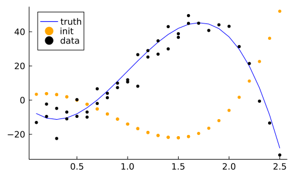
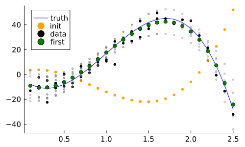
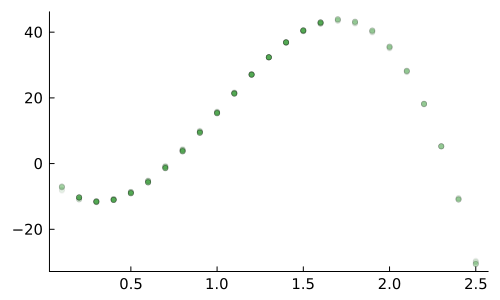
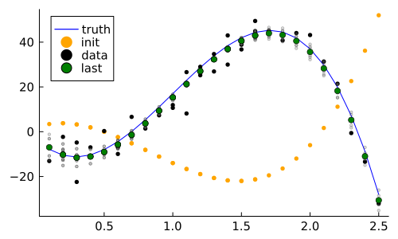

```@meta
EditURL = "tutorial_lit.jl"
```

# Tutorial
Notebook [download](tutorial.ipynb) [source](tutorial.jl)

````julia
using MGVI
````

````julia
using Distributions
using Random
using ValueShapes
using LinearAlgebra
using Optim
using AutoDiffOperators
import Zygote
````

We want to fit a 3-degree polynomial using two data sets (`a` and `b`). MGVI requires a model
expressed as a function of the model parameters and returning an instance of the Distribution.
In this example, since we have two sets of independent measurements, we express them as
ValueShapes.NamedTupleDist.


We assume errors are normally distributed with unknown covariance, which has to be learned as well.

````julia
context = MGVIContext(ADSelector(Zygote))

const _x1_grid = [Float64(i)/10 for i in 1:25]
const _x2_grid = [Float64(i)/10 + 0.1 for i in 1:15]
const _common_grid = sort(vcat(_x1_grid, _x2_grid))

function _mean(x_grid, p)
    p[1]*10 .+ p[2]*40 .* x_grid .+ p[3]*600 .* x_grid.^2 .+ p[4]*80 .* x_grid.^3
end

function model(p)
    dist1 = product_distribution(Normal.(_mean(_x1_grid, p), p[5]^2*60))
    dist2 = product_distribution(Normal.(_mean(_x2_grid, p), p[5]^2*60))
    NamedTupleDist(a=dist1,
                   b=dist2)
end
````

````
model (generic function with 1 method)
````

Here we define the ground truth of the parameters, as well as an initial guess.

````julia
const true_params =  [
 -0.3
 -1.5
 0.2
 -0.5
 0.3]

const starting_point = [
  0.2
  0.5
  -0.1
  0.3
 -0.6
];
````

````julia
function pprintln(obj)
    show(stdout, "text/plain", obj)
    println()
end;
````

````julia
using Plots
````

````julia
rng = MersenneTwister(157);
````

We draw data directly from the model, using the true parameter values:

````julia
data = rand(rng, model(true_params), 1)[1];
````

````julia
function _mean(x::Vector)
    _mean(_common_grid, x)
end

init_plots =() -> let
    truth = _mean(true_params)
    plot!(_common_grid, truth, markercolor=:blue, linecolor=:blue, label="truth")
    scatter!(_common_grid, _mean(starting_point), markercolor=:orange, markerstrokewidth=0, markersize=3, label="init")
    scatter!(vcat(_x1_grid, _x2_grid), reduce(vcat, data), markercolor=:black, markerstrokewidth=0, markersize=3, label="data")
end;
````

Before we start the optimization, let's have an initial look at the data.
It is also interesting to see how our starting guess performs.

````julia
p = plot()
init_plots()
savefig("tutorial-plot1.pdf")
savefig("tutorial-plot1.svg"); nothing # hide
````

[](tutorial-plot1.pdf)

Now we are ready to run one iteration of the MGVI.
The output contains an updated parameter estimate (`first_iteration.result`),
which we can compare to the true parameters.

````julia
first_iteration = mgvi_optimize_step(
    model, data, starting_point, context;
    linear_solver=MGVI.IterativeSolversCG((;maxiter=10)),
    optim_options=Optim.Options(iterations=10, show_trace=true),
)
@info hcat(first_iteration.result, true_params)
p
savefig("tutorial-plot2.pdf")
savefig("tutorial-plot2.svg"); nothing # hide
````

````
[ Info: [-0.5753822384418572 -0.3; -1.0619019629222095 -1.5; 0.16739039600215225 0.2; -0.43199660320081634 -0.5; -0.4670408148251532 0.3]

````

[](tutorial-plot2.pdf)

````julia
plot_iteration = (params, label) -> let
    #error_mat = mgvi_kl_errors(full_model, params)
    #display(error_mat)
    #errors = sqrt.(error_mat[diagind(error_mat)])
    #yerr = abs.(line(common_grid, params+errors) - line(common_grid, params-errors))
    #scatter!(common_grid, line(common_grid, params), markercolor=:green, label=label, yerr=yerr)
    for sample in eachcol(params.samples)
        scatter!(_common_grid, _mean(Vector(sample)), markercolor=:gray, markeralpha=0.3, markersize=2, label=nothing)
    end
    scatter!(_common_grid, _mean(params.result), markercolor=:green, label=label)
end;
````

Now let's also plot the curve corresponding to the new parameters after the first iteration:

````julia
p = plot()
init_plots()
plot_iteration(first_iteration, "first")
p
savefig("tutorial-3.pdf")
savefig("tutorial-3.svg"); nothing # hide
````

[](tutorial-3.pdf)

````julia
plot_iteration_light = (params, counter) -> let
    scatter!(_common_grid, _mean(params.result), markercolor=:green, markersize=3, markeralpha=2*atan(counter/18)/π, label=nothing)
end;
````

From the plot above we see that one iteration is not enough. Let's do 5 more steps and plot the evolution of estimates.

````julia
init_plots()
plt = scatter()
next_iteration = first_iteration
for i in 1:5
    @info minimum(next_iteration.optimized)
    @info hcat(next_iteration.result, true_params)
    global next_iteration = mgvi_optimize_step(
        model, data, next_iteration.result, context;
        linear_solver=MGVI.IterativeSolversCG((;maxiter=10)),
        optim_options=Optim.Options(iterations=10, show_trace=true)
    )
    plot_iteration_light(next_iteration, i)
end
@info minimum(next_iteration.optimized)
@info hcat(next_iteration.result, true_params)
plt
savefig("tutorial-plot4.pdf")
savefig("tutorial-plot4.svg"); nothing # hide
````

````
[ Info: 149.72168768839052
[ Info: [-0.5753822384418572 -0.3; -1.0619019629222095 -1.5; 0.16739039600215225 0.2; -0.43199660320081634 -0.5; -0.4670408148251532 0.3]
[ Info: 139.61657764952335
[ Info: [-0.34926933903802254 -0.3; -1.4861367175942468 -1.5; 0.197094201926156 0.2; -0.4932138649258529 -0.5; -0.4072545041142035 0.3]
[ Info: 138.92021444826864
[ Info: [-0.29689559638804497 -0.3; -1.5469191466068342 -1.5; 0.20086620148684828 0.2; -0.5002801928554658 -0.5; -0.38420663024791785 0.3]
[ Info: 128.45611149533966
[ Info: [-0.19749921728862457 -0.3; -1.6142374745470922 -1.5; 0.20442607354850353 0.2; -0.50658276851088 -0.5; -0.340772951976584 0.3]
[ Info: 128.6985310878273
[ Info: [-0.17164189100722393 -0.3; -1.6691205285442492 -1.5; 0.20839861520979996 0.2; -0.5146780120904751 -0.5; -0.32523828709910824 0.3]
[ Info: 126.64891177576091
[ Info: [-0.13684859214214423 -0.3; -1.7038572670794798 -1.5; 0.21051107616369666 0.2; -0.5186259556684072 -0.5; -0.31470532295882203 0.3]

````

[](tutorial-plot4.pdf)

Finally, let's plot the last estimate and compare it to the truth. Also, notice, that gray dots represent samples from
the approximation.

````julia
p = plot()
init_plots()
plot_iteration(next_iteration, "last")
p
savefig("tutorial-5.pdf")
savefig("tutorial-5.svg"); nothing # hide
````

[](tutorial-5.pdf)

---

*This page was generated using [Literate.jl](https://github.com/fredrikekre/Literate.jl).*

